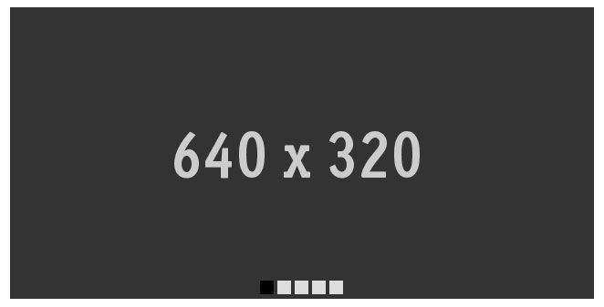

# Responsive Css Slider
===================

### How to play?
1. go to <http://hirokazunakajima.com/responsive-css-slider/>
2. just click small buttons
3. image position is gonna move associating button you clicked  
_change your device and enjoy_  
_turn off javascript and enjoy_

### What is it working in behind?

* `<input type="radio" id="buttonId">` and `<label for="buttonId">` in HTML
* CSS3 selecters `:checked` and ` ~ ` to get user interaction
* CSS3 property `transition` to make seamless moving